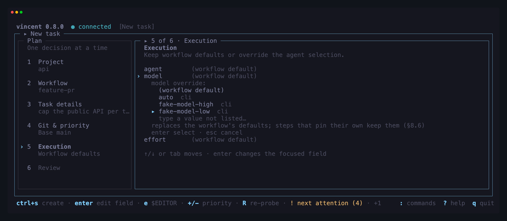
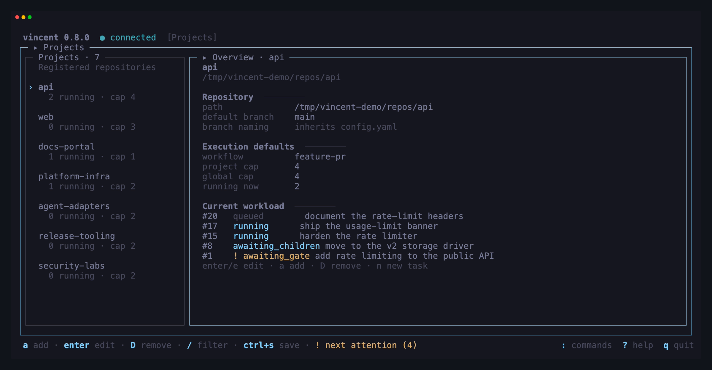
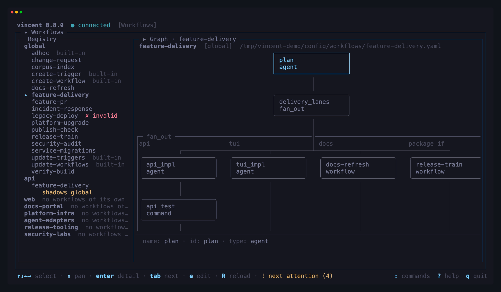

<p align="center">
  
</p>

<p align="center">
  <strong>Vendor-independent control plane for executing native agent tooling.</strong>
</p>

<p align="center">
  A local-first orchestrator for AI coding-agent workloads — monitor and manage<br>
  many agent tasks on your machine from one central place.
</p>

<p align="center">
  <a href="https://github.com/lezli01/vincent/actions/workflows/ci.yml"></a>
  <a href="LICENSE"></a>
  <a href="https://www.buymeacoffee.com/lezli01"></a>
</p>

<p align="center">
  <a href="#why-vincent">Why</a> &bull;
  <a href="#features">Features</a> &bull;
  <a href="#tui-tour">TUI Tour</a> &bull;
  <a href="#how-it-works">How It Works</a> &bull;
  <a href="#install">Install</a> &bull;
  <a href="#quickstart">Quickstart</a> &bull;
  <a href="#documentation">Documentation</a> &bull;
  <a href="#build--test">Build &amp; Test</a> &bull;
  <a href="#contributing">Contributing</a> &bull;
  <a href="#security">Security</a>
</p>

---

<p align="center">
  
</p>

<p align="center">
  <em>The TUI board — tasks with their state, step and cost; the step timeline of the selected task; and its
  agent's output streaming live. All of it read from the daemon over its localhost API.</em>
</p>

## Why vincent?

Coding agents are easy to start and hard to supervise: kick off a handful of
CLI runs across a few repositories and you are soon juggling terminals, losing
transcripts, and hand-managing branches. Vincent turns that into a managed
workload — one place to register repositories, author workflows, launch tasks,
and see what every agent is doing, with work continuing when no client is
attached.

The name is an acronym, and every part of it maps to the system:

- **Vendor-independent** — supports multiple agent providers and CLIs.
- **Control plane** — the daemon owns state, workflows, scheduling, and
  execution.
- **Executing** — vincent runs workloads rather than merely observing them.
- **Native agent tooling** — it invokes locally installed tools such as
  Claude Code, Codex, and Cursor.

Vincent is an operating layer for day-to-day agent work, not a terminal
multiplexer. It combines reusable workflows, durable scheduling, git isolation,
deterministic verification, human oversight, crash recovery, and live
observability in one self-contained binary. The same workload can be operated
from the TUI, scripted through the CLI, or integrated through the localhost API.

It is released under the [MIT License](LICENSE) and created by `lezli01` at
[lezli01.is-a.dev](https://lezli01.is-a.dev). Contributions are welcome — see
[Contributing](#contributing).

## Features

| Capability | What it gives you |
|---|---|
| **Durable local control plane** | A background daemon owns execution and state, so tasks keep running when terminals and TUI sessions close. Install it as a per-user service to resume work after login or reboot. |
| **Structured, reusable workflows** | Combine agent prompts, deterministic commands, approval gates, parallel groups, isolated fan-out, conditions, loops, breaks, and reusable includes in validated YAML. |
| **Agent choice at every level** | Run Claude Code, Codex, or Cursor using the CLIs and authentication already on your machine; choose the agent, model, effort, and permission mode per workflow, step, or task. |
| **Safe parallel development** | Every task receives its own git worktree and branch. Global and per-project concurrency caps, priorities, and platform restrictions keep many workloads organized without touching your checkout. |
| **Verification and recovery** | Checks decide whether work succeeded, retries receive the real failure, timeouts are enforced, transcripts are durable, and interrupted steps recover after a daemon restart. |
| **Human control where it matters** | Pause at approval gates, answer supported agents mid-run, inspect file-grouped diffs, edit and retry blocked steps, and decide when publishing happens. |
| **A TUI built for active workloads** | Use a grouped task board, guided task creation, project and workflow workspaces, bulk actions, live output, cost and duration metrics, and a navigable workflow graph. |
| **Automation-ready interfaces** | Every operation is available through CLI subcommands and a localhost REST + SSE API. `--json`, stable exit codes, and offline workflow validation make scripting and CI practical. |
| **Cross-platform delivery** | Run the same single binary on Windows, macOS, and Linux through Homebrew, WinGet, Scoop, mise, deb/rpm packages, or release archives. |

Explore the [complete feature guide](docs/features.md), or jump directly to the
[five-minute quickstart](#quickstart).

## TUI Tour

Every image here is a photograph of the running program, captured from a real
terminal by [`scripts/screenshots.sh`](scripts/screenshots.sh) against a seeded
daemon — not a mockup, and not a drawing of one.

<p align="center">
  
</p>

<p align="center">
  <em>The guided task flow keeps all six decisions visible while giving the active review stage room to breathe.</em>
</p>

<p align="center">
  
</p>

<p align="center">
  <em>Projects pairs a persistent repository rail with defaults, concurrency limits, and the selected project's current workload.</em>
</p>

<p align="center">
  
</p>

<p align="center">
  <em>The workflow registry stays anchored beside the navigable graph — scopes, shadowing and invalid entries on the left, fan-out lanes and their guards on the right.</em>
</p>

## How It Works

A background daemon owns all state and execution: register local git
repositories, author reusable workflows (agent prompts, shell commands, manual
gates), and run any number of tasks, each isolated in its own git worktree.
Agent steps drive locally installed agent CLIs (Claude Code, Codex, and
Cursor) headlessly. The TUI is a thin client over the daemon's API, so work
keeps running when no client is attached.

- **The daemon owns everything.** Clients never touch git, the database or an
  agent process — only the API. Killing every client changes nothing about
  running work.
- **Crash-first.** Every transition is persisted before it is acted on, so a
  daemon that dies mid-step finalizes the attempt on restart, kills verified
  orphans, and re-runs the step without consuming a retry.
- **Checks, not claims.** A step succeeds when its `check` command agrees, not
  when the agent says so — and a failed check retries with the failure appended
  to the prompt.
- **Nothing is silently abandoned.** A step that exhausts its retries blocks the
  task and waits for a human, keeping its worktree, branch and transcripts.
- **Differences are documented, never faked.** A capability an adapter lacks is
  stated and ignored at run time; it is never emulated.

### Agent CLIs

Each adapter runs the CLI you already have installed and authenticated;
vincent stores no credentials of its own. Select one per workflow, per step,
or per task (`agent: claude` / `codex` / `cursor`).

| Agent | Binary | Notes |
|---|---|---|
| Claude Code | `claude` | Mid-run questions supported — a step can pause in `awaiting_input` and be answered from the TUI |
| Codex | `codex` | Non-interactive once started; reports no cost |
| Cursor | **`cursor-agent`** | Non-interactive; reports no cost |

Three things to know about the Cursor adapter specifically:

- **Reasoning effort lives in the model id**, not in the `effort` field —
  `claude-sonnet-5-thinking-xhigh`, `gpt-5.4-mini-high`. Cursor has no effort
  flag, so `effort:` is ignored on cursor steps. Run `cursor-agent models` to
  see what your account offers.
- **A cursor step sets your saved CLI model.** Cursor persists the `--model`
  it is given to `~/.cursor/cli-config.json`, so vincent always passes one
  (defaulting to `auto`) to keep runs reproducible. The trade-off is that
  running a cursor step overwrites the model you last picked in an
  interactive `cursor-agent` session.
- **`restricted` permission mode needs macOS or Linux.** Cursor's sandbox is
  unavailable on Windows, so vincent refuses to create a task whose restricted
  step would run there — and a task that reaches the engine anyway fails with
  `restricted_unsupported` rather than silently running full-auto. That is
  deliberate: a restricted mode that quietly isn't restricted is worse than
  none.

Five ready-to-copy workflows ship in [`examples/`](examples), and
`vincent workflow init <name> --from <example>` installs one without a checkout;
[Writing workflows](docs/guides/workflows.md) is the authoring guide and
[Agent CLIs](docs/guides/agents.md) covers the adapters in full.

### Command line

`vincent` with no arguments opens the TUI (starting a daemon if none is
running). The subcommands are thin clients over the same API:

```sh
vincent daemon start                       # or stop / status
vincent service install                    # start at login, survive reboot
vincent project add /path/to/repo
vincent project ls
vincent task add --project 1 --title "Add a health endpoint"
vincent task ls --state running
vincent task show 7
vincent task cancel 7
vincent workflow init my-flow              # or --from feature-pr, --project 1
vincent workflow ls
vincent workflow validate .vincent/workflows/feature-pr.yaml
vincent workflow render .vincent/workflows/feature-pr.yaml
```

Every subcommand takes `--json` for scripting. Exit codes are `0` success,
`1` the request was rejected — by the daemon, or by a daemon-free command such as
`workflow validate` on an invalid file — and `2` no daemon answered
— so a script can tell "start the daemon" from "fix your request" without
parsing stderr. The subcommands never auto-start a daemon; only the TUI does,
because that is an interactive session you asked for.

`vincent workflow validate` and `vincent workflow render` run entirely locally
against the built-in agent catalogs — no daemon, no installed agent CLI — which
makes them usable from CI and pre-commit hooks; `validate` checks that every
template parses, `render` executes them. So does `vincent workflow init`, except
for `--project`, which needs a daemon only to resolve the id to a repository.

`vincent service install` registers the daemon with your OS so it starts at
login and survives reboot — a launchd user agent, a systemd user unit, or a
Windows Scheduled Task. It runs as **you** on every platform, since the OS user
is vincent's trust boundary: an agent gets your privileges, your agent-CLI
logins and your git identity, and nothing more. No elevation is needed
anywhere. One platform note: on Linux, surviving logout also needs `loginctl
enable-linger`, which the installer attempts and otherwise prints for you to
run.

The config and data directories are captured at install time, because a service
does not inherit the shell that installed it. On macOS and Linux **your `PATH`**
is captured too: those service managers supply their own minimal one, which
contains none of the places agent CLIs install to, so without this the daemon
would run and report every agent as missing. Install a CLI somewhere new and
you want `vincent service install` again to recapture it. Windows needs no
capture — the task runs in your logon session with your own `PATH`. If an agent
still will not resolve, point at it with `agents.<name>.path` in `config.yaml`,
which is absolute and never consults `PATH`.

On Windows it is a Scheduled Task and **not** a Windows Service, so it appears
in Task Scheduler as `vincent` and never in `services.msc`. It runs with no
visible window; `vincent service status` and `vincent daemon status` are how you
check on it. Install it from an **ordinary** prompt: a task registered by an
elevated one is owned by Administrators and leaves your own account unable to
replace or remove it, and both commands say so if you hit it.

Upgrading from a version that installed a Windows *Service*: it ran as
LocalSystem, which is why your TUI kept starting a daemon of its own.
`vincent service uninstall` from an elevated prompt removes it — once — and
then `vincent service install` needs no elevation again.

## Install

### Homebrew (macOS)

```sh
brew install lezli01/tap/vincent
```

The cask clears the quarantine attribute on install, so the binary runs
straight away — the macOS artifacts are not Developer ID signed (see **First
launch** below). Upgrades are `brew upgrade vincent`; `brew uninstall --zap
vincent` also removes the LaunchAgent and `~/Library/Application
Support/vincent` (config, database, transcripts).

Homebrew casks are macOS-only — on Linuxbrew, use the archive below.

Or install `vincent_*_darwin_universal.pkg` from the
[latest release](https://github.com/lezli01/vincent/releases/latest) — one
universal installer for both architectures. It is unsigned, so open it with
right-click → *Open*, or run `sudo installer -pkg vincent_*_darwin_universal.pkg
-target /`.

### WinGet or Scoop (Windows)

```powershell
winget install --id lezli01.Vincent --exact

# Or, with Scoop:
scoop bucket add vincent https://github.com/lezli01/scoop-bucket
scoop install vincent/vincent
```

Both install the same Windows zip published on GitHub. Releases are not
Authenticode-signed, so SmartScreen may still appear on first launch.

### deb or rpm (Linux)

Download the deb or rpm for your architecture from the
[latest release](https://github.com/lezli01/vincent/releases/latest), then:

```sh
sudo apt install ./vincent_*_amd64.deb       # Debian / Ubuntu
sudo dnf install ./vincent-*.x86_64.rpm      # Fedora / RHEL family
```

The deb and rpm files are release assets, not hosted apt/dnf repositories, so
download the next package to upgrade.

### mise (all platforms)

```sh
mise use -g github:lezli01/vincent
vincent version
```

mise selects the matching GitHub release archive for the current OS and
architecture. Pin a version with `github:lezli01/vincent@0.3.0`.

Package-manager metadata moves on stable releases only. If a newly added
channel has not received its first stable release yet, use mise or the archive
path below.

### Archive (all platforms)

Download the archive for your platform from the
[latest release](https://github.com/lezli01/vincent/releases/latest), unpack
it, and put `vincent` somewhere on your `PATH`. There is nothing else to
install — the binary is self-contained, with no runtime, no CGO and no
database server.

```sh
# macOS (Apple silicon) / Linux — adjust the asset name for your platform
tar -xzf vincent_*_darwin_arm64.tar.gz
sudo mv vincent /usr/local/bin/
vincent version
```

On Windows, unzip the archive and move `vincent.exe` somewhere on your `PATH`.

With a Go toolchain already installed, you can skip the archive entirely — this
builds from source, so it is not signed and not flagged, but it is also not
reproducible against a published checksum:

```sh
go install github.com/lezli01/vincent/cmd/vincent@latest
```

**First launch.** Releases carry cosign signatures, checksums and GitHub build
attestations everywhere, and no OS code signing on either macOS or Windows: an
Apple Developer Program membership and an Authenticode certificate are both
recurring purchases this project does not take on. So:

- **macOS** shows *"cannot be opened because the developer cannot be verified"*
  on a downloaded archive. Clear the attribute the browser set, once per
  download: `xattr -d com.apple.quarantine vincent`. The `.pkg` is unsigned
  too — open it with right-click → *Open* rather than a double-click, or run
  `sudo installer -pkg vincent_*_darwin_universal.pkg -target /`. Homebrew
  needs neither: the cask clears the attribute itself.
- **Windows** shows a SmartScreen prompt: *More info → Run anyway*. Releases are
  not Authenticode-signed — an OV certificate on a hardware token is a recurring
  purchase this project does not take on.

To verify a download instead of trusting it:

```sh
cosign verify-blob checksums.txt \
  --certificate checksums.txt.pem \
  --signature checksums.txt.sig \
  --certificate-identity-regexp 'https://github.com/lezli01/vincent/.*' \
  --certificate-oidc-issuer https://token.actions.githubusercontent.com
sha256sum -c checksums.txt --ignore-missing
```

You also need **git** and at least one agent CLI (`claude`, `codex` or
`cursor-agent`) installed and logged in — vincent runs the CLI you already have
and stores no credentials of its own. Per-platform detail, build-from-source
and upgrade instructions:
[Installation](docs/getting-started/installation.md).

Vincent currently follows **pre-1.0 Semantic Versioning**. The config file,
workflow YAML schema, REST API and CLI flags may change in a minor release — pin
a version if you script against them. Patch releases are fixes only, and the
on-disk database migrates forward automatically. Full policy and release history:
[changelog](https://lezli01.is-a.dev/vincent/changelog.html).

## Quickstart

> [!WARNING]
> **Agents run full-auto by default: they can execute arbitrary commands as
> you.** This is intentional — unattended
> orchestration is the point. The git worktree isolates tasks from *each
> other*, not from your machine: an agent can still reach your home
> directory, your credentials and the network. Nothing is pushed or merged
> unless a workflow step does it, everything is transcripted, and any step can
> be set to `permission_mode: restricted`. Run it on repositories you would
> hand to a new contributor, and read the
> [Security model](docs/security-model.md) before pointing it at anything else.

Five minutes, one real task:

**1. Register a repository.** Any git repo with a clean working tree.

```sh
vincent project add /path/to/your/repo
vincent project ls
```

**2. Add a workflow.** Two places to put one:

- **Global** — available to every project. Drop it in the `workflows/` folder
  of your config directory:
  `%APPDATA%\vincent\workflows\` (Windows),
  `~/Library/Application Support/vincent/workflows/` (macOS),
  `~/.config/vincent/workflows/` (Linux).
- **Project** — travels with the repo, and shadows a global file of the same
  name: `.vincent/workflows/` inside the repo.

Either way the daemon picks it up on save; there is no restart or apply step.
Global is the easier start, and the binary writes the file for you — one command
on all three platforms, no checkout of this repository and no daemon needed:

```sh
vincent workflow init feature-pr --from feature-pr
```

It creates the directory if it is missing, writes the shipped example with its
comments intact, and prints the path. Drop `--from` for a commented
one-agent-step skeleton, or add `--project 1` to write into that repository's
`.vincent/workflows/` instead. It refuses rather than overwriting anything
already there.

```sh
vincent workflow validate ~/.config/vincent/workflows/feature-pr.yaml
vincent workflow ls              # global + built-in
vincent workflow ls --project 1  # add this project's own .vincent/workflows
```

`feature-pr` runs an agent, checks that the result still builds and passes
tests, stops at a human gate, and pushes only after you approve. The others
are [`fix-and-test`](examples/fix-and-test.yaml) (write a failing test, then
fix it), [`converge`](examples/converge.yaml) (loop until the suite is green),
[`docs-update`](examples/docs-update.yaml), and
[`cursor-review`](examples/cursor-review.yaml).

Its check is `go build ./... && go test ./...`, so open the file and change
that line to whatever proves *your* repository still works before pointing it
somewhere else.

**3. Run a task.**

```sh
vincent task add --project 1 --workflow feature-pr \
  --title "Add a --version flag to the CLI"
vincent task ls
```

**4. Watch it, then approve it.**

```sh
vincent            # the TUI: board, live output, diff, and the gate
```

The task appears on the board, runs in its own worktree on branch
`vincent/{id}-{slug}` by default, and stops at the `review` gate. Read the diff in the
TUI, press `a` to approve, and the publish step pushes the branch. `q` quits
the TUI — the daemon and any running task keep going without it.

Everything the TUI does is a subcommand, and everything either does is the same
localhost API. That covers the data commands (`vincent task show 1`, plus
`project`, `workflow` and `daemon`) and every human action on a live task —
`approve`, `reject`, `retry`, `repair`, `skip`, `pause`, `resume`, `answer`,
`archive`, `follow-up` — so a blocked task can be rescued from a shell loop
rather than from a terminal:

```sh
vincent task ls --state blocked --json | jq -r '.[].id' |
  while read -r id; do vincent task retry "$id"; done
```

The [CLI reference](docs/reference/cli.md) is the full tree. To keep the daemon
running across reboots, `vincent service install`.

**Next:** [writing your own workflows](docs/guides/workflows.md), or the
[longer quickstart](docs/getting-started/quickstart.md).

## Documentation

Full documentation lives in **[docs/](docs/README.md)**.

**Start here**

- [Features](docs/features.md) — the product tour and common use cases
- [Why vincent is awesome](docs/why/README.md) — the stories and recurring
  workflows that led to it
- [Installation](docs/getting-started/installation.md) — download, verify, and
  install an agent CLI
- [Quickstart](docs/getting-started/quickstart.md) — first task, end to end
- [Concepts](docs/getting-started/concepts.md) — daemon, project, workflow,
  task, worktree

**Guides**

- [Writing workflows](docs/guides/workflows.md) · [Agent CLIs](docs/guides/agents.md)
- [Using the TUI](docs/guides/tui.md) · [Scripting vincent](docs/guides/scripting.md)
- [Running at login](docs/guides/running-at-login.md) · [Troubleshooting](docs/guides/troubleshooting.md)

**Agent skill**

Install the portable workflow-authoring skill for Claude Code, Codex, Cursor,
or another Agent Skills client:

```sh
npx skills add lezli01/vincent --skill vincent-workflows -g
```

It asks about human gates and cost constraints, prefers deterministic commands
and native control flow, and validates generated workflow YAML.

**Platforms** — [Windows](docs/platforms/windows.md) ·
[macOS](docs/platforms/macos.md) · [Linux](docs/platforms/linux.md)

**Reference** — [CLI](docs/reference/cli.md) ·
[Configuration](docs/reference/configuration.md) ·
[Files and directories](docs/reference/files.md) ·
[Workflow schema](docs/reference/workflow-schema.md) ·
[Task lifecycle](docs/reference/task-lifecycle.md) ·
[HTTP API](docs/reference/api.md)

**Also** — [Security model](docs/security-model.md) · [FAQ](docs/faq.md) ·
[Changelog](https://lezli01.is-a.dev/vincent/changelog.html) · [Contributing](https://lezli01.is-a.dev/vincent/contributing.html)

## Build & Test

Vincent is a single Go module; Go 1.26 or newer is the only prerequisite.
`go.mod` pins an exact patch toolchain that the default `GOTOOLCHAIN=auto`
fetches on the first build.
Build targets run via [mage](https://magefile.org/) with zero install — CI
runs exactly these targets (list them all with `go run mage.go -l`):

```sh
go run mage.go build     # build the vincent binary into bin/
go run mage.go test      # run all tests
go run mage.go testrace  # run all tests with the race detector (needs cgo and a C compiler)
go run mage.go lint      # golangci-lint (pinned via go.mod tool directive)
```

The plain toolchain works too:

```sh
go build ./...   # compile every package
go test ./...    # run the full test suite
```

Tests are self-contained: they run against temporary SQLite databases,
throwaway git repositories, and a fake agent built from `cmd/fakeagent` on
the fly — no real agent CLI, network access, or running daemon required.
CI runs lint, the race-enabled tests, and the build on Linux, macOS, and
Windows, plus seven end-to-end acceptance gates that exercise the daemon,
workflow engine, adapters, control flow, and API against the fake agent on all
three platforms.

## Contributing

Contributions of every size are welcome — bug reports, docs, test cases, and
features. Start here:

- Read the [Contributing guide](https://lezli01.is-a.dev/vincent/contributing.html) for development setup, build
  and test commands, and the commit-message convention.
- Be a good neighbor: this project follows a
  [Code of Conduct](CODE_OF_CONDUCT.md).
- Found a bug or want a feature? Open an
  [issue](https://github.com/lezli01/vincent/issues/new/choose).

All changes land via pull request to `master`, merged with merge commits (no
squashing), using [Conventional Commits](https://www.conventionalcommits.org/).
Conventional prefixes belong on commit messages; PR titles use plain language so
release automation does not duplicate the change through the merge commit.
Details are in the [Contributing guide](https://lezli01.is-a.dev/vincent/contributing.html).

## Security

Vincent executes AI agents in full-auto mode by default — a documented design
decision, not a vulnerability. In full-auto an agent can run arbitrary commands
**as the invoking user**, and a git worktree isolates collisions between tasks,
not privileges; the TUI shows this warning once on first run. The full picture —
the trust boundary, what `restricted` mode does per adapter, and how to tighten
a setup — is in the [Security model](docs/security-model.md).

Security reports are taken seriously — please report vulnerabilities
privately via GitHub's
[security advisories](https://github.com/lezli01/vincent/security/advisories/new)
rather than a public issue. See [SECURITY.md](SECURITY.md) for details.

## License

Vincent is released under the [MIT License](LICENSE). © 2026 lezli01.
