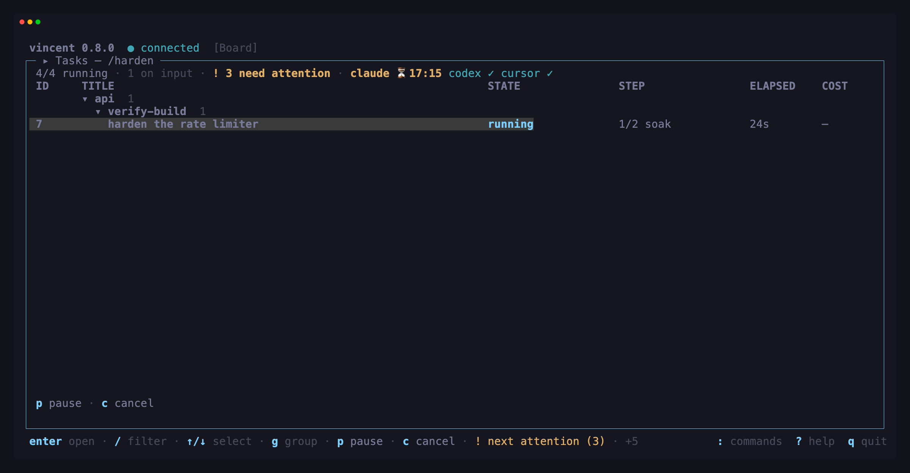

# Using the TUI

`vincent` with no arguments opens the terminal UI, starting a daemon if none is
running. It is a pure API client: it holds no state the daemon does not have,
and quitting it never affects work.

```sh
vincent          # opens the TUI
```

- [The first run](#the-first-run)
- [Layout](#layout)
- [The board](#the-board)
- [Acting on several tasks at once](#acting-on-several-tasks-at-once)
- [Task detail](#task-detail)
- [Answering a question](#answering-a-question)
- [The takeover screens](#the-takeover-screens)
- [The command palette](#the-command-palette)
- [Every key](#every-key)
- [Mouse, selection and paste](#mouse-selection-and-paste)
- [When the daemon is unreachable](#when-the-daemon-is-unreachable)

---

## The first run

The very first launch shows a one-time notice: **agents run full-auto by
default and can execute arbitrary commands as you**. Acknowledge it once and it
does not return. The acknowledgment is stored in `{data_dir}/tui.json`.

It is worth reading rather than dismissing — [Security model](../security-model.md)
is the longer version.

## Layout

The home screen is the task board and nothing else:



`enter` opens the selected task in a separate full-screen workspace. That
workspace has five full-view tabs — **Steps & Attempts**, **Task Details**,
**Output**, **Diff**, and **Workflow** — so the surface being read gets the
whole terminal. `tab` advances through them, `shift+tab` goes back, and `1`–`5`
jump directly. `esc` returns to the board.

New task, projects, workflows, daemon, and — for GitHub projects — pull
requests are full-screen takeovers too. `esc`
closes one layer at a time (popup → task/screen → selection → filter) and
**never quits**.

At **128×24 and above**, New task, Projects, and Workflows use that room as a
guided two-pane surface: progress or resources stay in a narrow rail, and the
current decision gets the rest of the screen. Below that size they fall back to
the compact form, table, or registry. Resizing does not move the cursor or close
the picker, editor, project form, workflow expansion, or graph you were using.

## The board

One row per task: id, project, title, state, current step `k/n` with its name,
elapsed, and cost so far. The header shows daemon status, agent availability,
running-versus-cap counts, and how many tasks need a human.

Three behaviors matter:

- **Tasks waiting on a human are pinned to the top** with a distinct badge —
  `awaiting_input`, `awaiting_gate` and `blocked`. `!` jumps to the next one from
  anywhere.
- **The terminal bell rings when a task enters `awaiting_input`**, so most
  terminals flash or badge the window even when it is not focused.
- **A task waiting on a clock says when it resumes.** A task whose agent hit a
  usage limit — or whose failed step is pacing its next attempt with
  `retry_backoff` — is `queued` like any other, but its state cell reads
  `queued → 14:20`, the time vincent will try it again, on its own. It holds no
  slot and needs nothing from you; the detail header names the reason in full
  (`queued · usage limit → 14:20`, `queued · retry backoff → 14:20`). See
  [Troubleshooting](troubleshooting.md#usage_limit--do-nothing) and
  [`retry_backoff`](troubleshooting.md#retry_backoff--also-do-nothing-but-for-a-different-reason).
- **The header badges the agent, not just the task.** An adapter vincent has
  watched run out reads `claude ⏳14:20` in place of `claude ✓`, and stays that
  way until a step on that adapter succeeds — so a board full of `queued` rows
  says which window they are all waiting on. The badge is a statement, not a
  brake: admission is unchanged and nothing is withheld.

`/` filters by id, title, project or state; `tab` commits the filter, `esc`
clears it, and `enter` opens the selected task.

**A cell too long for its column wraps rather than disappearing.** The title,
the state, the step and the status carry across up to three lines of the same
row, so `awaiting_children (2 blocked)` and a step's own message are readable
without opening the task. Every row on a board is the same height — as tall as
the tallest row in the list, and never more than three lines — so a board where
nothing overflows is one line per task, exactly as before. The list, not the
part of it you can see: one long title far down the board makes the rows above
it tall too, and a filter that hides it makes them short again. What still does
not fit at three lines ends in `…`. Clicking any line of a row selects that row,
and `j`/`k` move a task at a time whatever the height. The id, elapsed, cost
and the marker column do not wrap, and neither do project and workflow: those
two are names you scan down, which a fourteen-cell wrap makes unreadable, so
under width pressure they are dropped instead.

**The title has a ceiling.** It takes whatever the fixed columns leave, up to a
comfortable width; past that the extra room goes to `STEP` and then `STATUS` —
the two columns whose content actually outgrows them — and only what neither
can use comes back to the title. So a 200-column board shows
`3/7 green · loop 4/10` whole instead of spending the room on a title's
trailing blanks.

A wide terminal also gets a **`STATUS` column**: what the task's newest step run
said about *itself*, if it said anything —
`compiling internal/store`, `3 tests red`. It is set by the step, not by
vincent, through [`vincent status`](../reference/cli.md#vincent-status), so it
is empty until a workflow asks for it; see
[Reporting status from a step](workflows.md#56-reporting-status-from-a-step).
It is the first column dropped when the terminal narrows, and it needs a
comfortably wide title to be admitted at all — so a board that has never seen it
is a board that has the width for everything else instead.

Elapsed on the board is **wall clock** from the task's start. That is
deliberate: a task idle on a human for 35 of its 40 minutes must not read as
"5m" on the board whose job is to flag it. The per-attempt figures in the
timeline are the other measure — active time, with the excluded wait shown
beside it rather than silently subtracted.

### Grouping

The rows are **grouped by project, and by workflow within a project**, out of
the box:


- The header shows the group's task count, and the needs-attention badge when
  it holds any — a group can never be the reason you missed something waiting.
- **Grouping does not reorder anything.** The sort is what it always was, and a
  group sits where its first task does, so the group holding the oldest thing
  waiting on a human is the top group.
- A grouped level loses its column — the header already names it — and the
  width it frees is spent on the row: on the title first, and once the title
  has reached its ceiling, on `STEP` and `STATUS`.
- An open header is a label: the cursor steps over it, and clicking it selects
  nothing.

`g` cycles project›workflow → project → workflow → flat for the session. The
panel title names the grouping whenever it is not the configured one.

### Folding groups

On an installation with six projects on it, most of the board is not what you
are working on. Fold the rest away:

| Key | Does |
|---|---|
| `←` | Collapse the group you are in. Press it again on the header it closed to fold the group around that |
| `→` | Expand the collapsed group under the cursor, one level |
| `C` | Collapse every group |
| `O` | Expand every group |

A collapsed header shows `▸` instead of `▾`, and it keeps everything that made
the group worth reading at a glance: the task count, the `!` needs-attention
badge, and how many of its tasks are selected. **The cursor rests on a collapsed
header** — that is what makes it a row rather than a label, and it is how `←`
and `→` reach every nesting level. It is not a task, so the action keys, `space`
and `enter` do nothing there.

Three things mean a fold can never hide work waiting on you:

- the header's badge and count survive the fold;
- `!` (jump to the next task needing a human) opens whatever group it lands in;
- a collapsed group **opens by itself** the moment a task inside it starts
  waiting for input.

Folds are remembered across restarts, in `{data_dir}/tui.json`
([files](../reference/files.md)). They survive `g`, a filter and a reconnect,
and a group is forgotten when its project or workflow leaves the board. `V`
still selects tasks inside a collapsed group — the selection is a set of tasks,
not of rows. With `group_by: []` there are no groups, so the four keys do
nothing. A fresh install has nothing folded.

Set the grouping you start with in `config.yaml`
([`tui.board.group_by`](../reference/configuration.md#tuiboardgroup_by)); `[]`
gives you one flat list.

### Acting on several tasks at once

Archiving yesterday's finished work one row at a time is the same keypress ten
times with a confirmation between each. Select the tasks instead:

| Key | Does |
|---|---|
| `space` | Select the task under the cursor (again deselects) |
| `V` | Select every task the filter is showing — or clear that selection |
| `L` | Drill into the selected fan-out's lanes, or back out. Lanes are hidden from the board otherwise |
| `esc` | Clear the selection |

While anything is selected, a `✓` appears beside those rows, the panel title
counts them (`Tasks — 5 selected`), and the **action keys act on the whole
selection**:


The count beside each key is how many of the selected tasks that action can
actually move — an action shows up when *some* selected task accepts it, and the
ones that do not are left alone. So a selection holding four finished tasks and
one still running offers `A archive (4)`, and the running one stays where it is.

The rest of the behavior follows from what a selection is:

- **It is a set of tasks, not of rows.** Filtering, regrouping and refreshing do
  not change it — that is why the count is in the title, so a selected task the
  filter is hiding still says it is coming along.
- **One confirmation for the batch.** `A` asks once, about all of them. Behind
  the scenes vincent sends one ordinary action per task, so the daemon sees
  nothing special; you get one line back: how many moved, and the first refusal
  named if any refused.
- **Uncommitted changes still re-prompt.** A bulk archive archives the clean
  worktrees and asks again about only the dirty ones —
  `2 of 5 selected tasks have uncommitted changes`.
- **What succeeded leaves the selection; what failed stays in it**, so a retry
  needs no re-selecting.
- **The keys work from any panel.** Whatever has focus, the footer is counting
  the selection, so that is what `A` acts on.

## Task detail

`enter` opens the selected task on **Steps & Attempts**, the default tab. It
lists every attempt of every step with its duration, tokens and cost. Selecting
an attempt chooses what the separate **Output** tab shows; the selection stays
put while you move between tabs. Press `enter` on an attempt to jump straight
to its output.

**Task Details** is the complete task inspector: title, description, declared
fields, state, project, workflow and its recorded origin, branch and worktree,
priority, tokens and cost, lifecycle timestamps, queue/block information,
pending input, fan-out/loop metadata, captured GitHub issue, available actions,
and the task's workflow-step snapshot. Its left sidebar selects one section at
a time, so unrelated metadata does not compete for the screen. Use `↑`/`↓` or
the mouse to choose a section and `pgup`/`pgdn` to scroll long section content;
the inspector never edits anything.

Its **GitHub pull request** section follows the captured issue and shows one of
three things: the pull request linked to this task with its live state, the
reason the integration is unusable, or — when nothing is linked — the offer to
open one. Two keys work there:

| Key | Does |
|---|---|
| `o` | Open this task's pull request in a browser |
| `P` | Push this task's branch to `origin` and open its pull request — the title, body and draft flag are editable first |

`P` opens a small popup with the title and body vincent guessed from the task,
plus a draft toggle — all three editable:

| Key | Does |
|---|---|
| `↑` / `↓` | Move between the title, the body and the draft row |
| `enter` | Edit the row under the cursor, or toggle the draft row |
| `space` | Toggle draft / ready for review, on the draft row |
| `e` | Write that row in `$EDITOR` instead |
| `ctrl+s` | Push the branch and open the pull request |
| `ctrl+o` | Open GitHub's own new-pull-request page with this prefill instead |
| `esc` | Close without sending anything — the draft is discarded |

Inside a field `enter` is a newline (a pull-request body usually wants more than
one line), `ctrl+s` keeps the text, and `esc` discards it. A title is required:
`ctrl+s` without one says so rather than sending something GitHub cannot use.

`ctrl+s` is **the one thing vincent writes to GitHub.** It pushes committed work
only — anything uncommitted in the task's worktree is not in the pull request,
which the popup says above the rows — and it never force-pushes: a diverged,
protected or rejected push creates no pull request and changes nothing on the
remote. Pressing it twice sends once.

If there is no credential with write scope, or GitHub refuses the create, the
branch is still pushed and the popup points you at `ctrl+o`, whose page now
works because the branch is on the remote. The TUI itself never talks to GitHub:
every call is the daemon's.

`o` and `P` are absent unless at least one registered project's GitHub
integration is usable. Linking lives on the pull-requests screen below;
unlinking lives there and on the Pull Request tab.

**Output** gives the selected attempt's live tail or historical transcript the
entire view. Its selector names the attempt and its position in the task; use
`←`/`→` (or `h`/`l`) to show another attempt without returning to the timeline.
**Pull Request** is the sixth tab, and the only one that is sometimes not
there: it appears when the task has a pull request linked and `github.enabled`
is on. It carries the pull request's facts and one row per check on its head
commit — name, state, and the check's own page — read live from the daemon on
open, on a reconciler tick, on its own poll and on `r`. Nothing about a check
is stored, because a stored check result reads exactly like a current one
while being wrong. `↑`/`↓` select a row, `c` opens it in a browser, `o` opens
the pull request and `u` unlinks it from the task; the refusal is sticky, so
the reconciler will not link it again. Nothing here writes to GitHub.

**Diff** gives the task's file-grouped git diff the entire view. **Workflow**
draws the workflow this task ran as a control-flow graph with its run state on
it; it is documented beside the workflows screen's graph, under *Workflows*
below.

The header names the task's workflow and, in brackets, where that definition
came from: `adhoc (built-in)`, `adhoc (project .vincent/workflows/adhoc.yaml)`,
`release (global workflows/release.yaml)`, `api (derived from task 41)` for a
fan-out lane, or `adhoc (unknown)` for a task created before vincent recorded
it. A project or global file shadows a built-in of the same name, so the name on
its own does not say which one ran.

It sits late in the header — after the branch, before the run's cost — so a
narrow pane truncates it early;
[`vincent task show`](../reference/cli.md#vincent-task-show) prints the same
thing plus the source digest, and is where an audit is actually done.

A structure step gets a tier of its own. A `parallel` group's sub-steps share
the group's index, so the group is one header and each sub-step sits beneath
it. A `loop` (§7.8) goes one further: its body's rows are grouped **by
iteration**, folded shut with the latest one open, and a `for_each` iteration's
header names the item it ran on. Ten passes of a four-step body is forty rows,
and the one you arrived to read is almost always the pass it stopped on.

The board's and the header's step column say the same thing more briefly: a
task inside a loop reads `3/7 green · loop 4/10`.

Two things on an attempt line are worth telling apart. A red word like
`check_failed` is vincent's **failure reason** — a fixed set of constants, and
vincent's own verdict. A cyan `» 3 tests red in internal/store` is the step's
own **status message**, free text it set while it was running and the last thing
it said before it ended. It is never a cause: a step killed on a timeout may be
carrying a line it wrote half an hour earlier.

An attempt that did **not** succeed also gets a dim line beneath it with its
**result summary** — the agent's final message, or the tail of a command's
output. It is the sentence that decides whether to open the transcript.

| Key | Does |
|---|---|
| `tab` / `shift+tab` | Next / previous task tab |
| `]` / `[` | Next / previous task tab |
| `1`–`5` | Steps & Attempts / Task Details / Output / Diff / Workflow |
| `6` | Pull Request — only when this task has a linked pull request and GitHub is on; `tab`/`shift+tab` skip it otherwise |
| `enter` | From Steps & Attempts, open the selected attempt in Output |
| `←`/`→` or `h`/`l` | On Output, select which attempt's output to show |
| `f` or `G` | Follow the live output again |
| `v` | More or less detail: compact → normal → verbose (reasoning, the run's own metadata, then unrecognized lines) |
| `e` | Open this attempt's **whole** transcript in `$EDITOR` |
| `↑`/`↓` | Select an attempt or Task Details section, scroll Output, or move between diff files — according to the active tab |
| `pgup`/`pgdn` | Scroll the selected Task Details section |

### What `v` adds

`compact` is what the agent **said and did**, and nothing else. Reasoning is
hidden, and so is everything about the run itself.

`normal` adds reasoning, truncated to its first lines — and, for an agent whose
CLI reports them, two records that answer questions the pane could not answer at
all before. A `#` line at the top of the run names the directory the agent said
it was working in and the tools it was given, which is the only place *"what
could this agent actually reach"* is written down. And the closing `✓` line
carries the run's own account of itself: how long it took, how many turns it
burned, how many tool calls a permission rule refused, and — when it is not the
ordinary one — why it stopped. `stop: max_tokens` on that line is the difference
between a model that finished and a model that ran out, which both read as a
bare success before.

`normal` also carries the agent's **running to-do list**, on a `☰` line, for a
CLI that reports one. Every version of the list arrives whole rather than as a
change to the last one, so the line shows where the agent *is* — done entries
`✓` and dimmed, pending ones `○` — and a reader who opens the pane mid-run does
not have to reconstruct it. It sits at `normal` for the reason the run header
does: a plan is what the agent *intends*, which is neither what it said nor what
it did.

`verbose` adds the API-time split, the cache read/write token split, a per-model
breakdown for a run that used more than one, and the lines vincent's parsers do
not model, expanded out from behind their count.

`verbose` is also the only level that shows **what a command printed** — the
output body itself, flush left and dim, the way a command step's own output
renders, because it is the same thing rather than vincent's account of one. It
is held back below `verbose` deliberately: a step running `go test ./...` would
otherwise flood the level most readers use. A body long enough to hit the cap
ends in **… output truncated**, because a cut a reader cannot see is
indistinguishable from a command that printed exactly that much.

A tool call that a permission rule **refused** is marked `⊘` rather than `✗`, at
every level. The distinction is worth a glyph: `✗` is the agent's problem, and
`⊘` is the step's [permission mode](agents.md).

Only [Claude Code](agents.md#claude-code) reports the run header and the run
metadata today. On codex and cursor those lines simply do not appear — vincent
does not synthesise one from what it happens to know. The plan and the command
output run the other way: only [Codex](agents.md#codex) reports those, and on
claude and cursor they are absent for the same reason rather than invented.

### Reading the whole transcript

The output pane holds the **end** of a transcript — the last 256 KB, capped at
5000 records — because a single attempt is allowed to produce gigabytes. When a
step fails, the part you want is often the beginning, which is exactly the part
not on screen. When it has dropped something, the first line in the pane says
so: **… earlier output truncated — press e for the whole transcript**.

`e` hands the complete file to your `$EDITOR`, the same way `e` opens a
workflow file in the workflows view. What opens is the raw JSONL on disk —
the lossless record, including lines vincent's parsers do not recognize —
rather than the pane's rendering. It is the same file
`vincent task show <id>` prints the path of.

Two cases answer instead of opening: a step that never wrote a transcript (a
manual gate), and a transcript that retention has already
[pruned](../reference/configuration.md#transcript_retention_days). Neither
opens an empty buffer, because an empty buffer reads as "the step produced
nothing".

**Follow mode belongs to the live attempt.** It is unavailable on a finished
one, and a step advance moves your selection only if the cursor was already on
the live attempt — so reading an old step is never interrupted by a new one
starting.

### The Diff tab

The **Diff** tab is `git diff` against the merge-base with the commit the task
was cut from, including uncommitted changes, syntax-highlighted. It is fetched
when you activate the tab and on an explicit refresh, never on every output
chunk.

It is **grouped by file**, and every file starts **collapsed** — so the first
thing you see is what the task touched, not the first eighty lines of whichever
file git wrote first:


| Key | Does |
|---|---|
| `↑`/`↓` | Move between files (the pane scrolls to keep the cursor in view) |
| `enter` or `space` | Expand or collapse the file under the cursor (`→`/`←` too) |
| `O` | Expand every file |
| `C` | Collapse every file — which is how the tab opens |
| `pgup`/`pgdn`, `f`/`b`, `u` | Scroll by lines inside what is expanded |
| `[` | Back to the Output tab (`]` advances to Workflow) |

Clicking a file's row folds it; clicking a line of code selects its file and
leaves it open. The mouse wheel scrolls whichever tab is on screen.

The counts beside each path are the added and removed lines inside that file's
hunks, and the line above the list totals them. A **binary** file says so
instead of showing `+0 -0`, and a rename reads `old → new`.

Folds are remembered **per file path**, so leaving and re-entering the tab — a
refresh — keeps what you had open, even if the agent has since touched other
files. Moving to another task starts collapsed again, and nothing is written to
disk: a fold is how you are reading one diff, not a setting.

### The action bar

Below the panes, the action bar shows **exactly the actions valid in the
current state** — the daemon computes that list, the TUI renders it. With tasks
selected on the board it acts on all of them; see
[Acting on several tasks at once](#acting-on-several-tasks-at-once).

| Key | Action | Valid from |
|---|---|---|
| `a` | Approve the gate | `awaiting_gate` |
| `x` | Reject the gate | `awaiting_gate` |
| `r` | Retry the blocked step | `blocked` |
| `R` | Repair with an agent — a one-off run in this task's worktree | `blocked` |
| `E` | Edit the step's prompt or command in `$EDITOR`, then retry | `blocked` |
| `s` | Skip the current step | `blocked`, `awaiting_gate` |
| `p` | Pause / resume | `queued`, `running` / `paused` |
| `c` | Cancel the task (asks first — a running step is killed) | most states |
| `A` | Archive (asks first — the worktree is removed) | `done`, `aborted` |
| `F` | Follow up — run more work in this finished task's worktree | `done`, `aborted` |

`E` opens the failing step's prompt or command in your editor, and the override
applies **to this task's snapshot only** — the workflow file is untouched.

`R` and `F` open a form instead of acting straight away; they are the two task
actions that need something written, which is also why neither is offered for a
bulk selection.

What each action means in full is in
[Task lifecycle](../reference/task-lifecycle.md).

## Repairing a blocked task

`r`, `E` and `s` all leave the worktree exactly as the failed step left it —
they re-run a step, rewrite its text, or walk past it. When what is wrong is a
*file*, press `R` on a `blocked` task and a one-off agent goes and fixes it, in
this task's worktree, on this task's branch.

| Key | Does |
|---|---|
| `↑` / `↓` | Move between the prompt and the agent / model / effort rows |
| `enter` | Open the row under the cursor — the prompt field, or that row's picker |
| `e` | Write the prompt in `$EDITOR` instead |
| `ctrl+s` | Start the repair |
| `ctrl+t` | Switch between the form and this task's details, without leaving the popup |
| `esc` | Close without repairing — the draft is discarded |

The prompt is the only required row, and it is prose: write what you want done,
not a template. The daemon puts the context around it — the task, the blocked
step's rendered prompt or command, the failure reason and exit codes, the last
200 lines of the failed attempt's transcript and the path to the whole file, so
the agent can read further itself.

Inside the prompt field `enter` is a newline (a repair prompt usually wants
more than one line), `ctrl+s` keeps the text, and `esc` discards it. Agent,
model and effort are optional; set they apply to this run only and win over the
task's overrides and the workflow's defaults.

When the repair agent finishes the task returns to `blocked` — same step, same
reason — whatever it exited with. That is the point: you look at the diff and
*then* decide whether to `r`. The repair appears in the timeline as its own
entry under the blocked step, labelled `repair (ad-hoc agent)`, with its own
transcript, tokens and cost; it is not an attempt of that step and does not use
up its retries.

## Following up on a finished task

A `done` or `aborted` task still owns everything it made — its worktree, its
branch, its commits — until you archive it. `F` is how you do one more thing in
there without leaving vincent: rebase the branch onto a `main` that moved, add
the commit a reviewer asked for, drop the stray file the agent left.

| Key | Does |
|---|---|
| `↑` / `↓` | Move between the run form, what to run, and the agent / model / effort rows |
| `enter` | Open the row under the cursor — the run-form list, the text field, or that row's picker |
| `e` | Write the prompt or command in `$EDITOR` instead |
| `ctrl+s` | Start the follow-up |
| `ctrl+t` | Switch between the form and this task's details, without leaving the popup |
| `esc` | Close without running anything — the draft is discarded |

The top row picks what kind of run this is, and it decides what the row under it
means:

| Run form | The row below it is |
|---|---|
| `agent` | a prompt — prose, not a template |
| `command` | a shell command, run under the daemon's shell (`/bin/sh`, or `pwsh` on Windows) |
| `workflow` | a name picked from the registry, run against this task's worktree instead of a new one |

Switching between the three keeps what you typed in each, so you can look at the
command form and come back to your prompt.

When the run finishes, the task returns to the state it came from — `done` to
`done`, `aborted` to `aborted` — whatever it exited with. A follow-up never
changes a task's verdict; if a successful one could promote an aborted task to
`done`, any command that exits 0 could undo an abort you made on purpose.

Follow-ups are repeatable, and each one is a **round**. The timeline heads them
`↳ follow-up 1`, `↳ follow-up 2` under the workflow's own steps, with each step
of the round named beneath — they are not steps of the workflow, and the
workflow's `k/n` does not move.

If a follow-up step fails the task blocks at that round, and the usual keys
mean the usual things there: `r` re-runs the follow-up where it stopped, `R`
repairs against *that* failure, `s` abandons the follow-up and puts the task
back where it came from, `c` aborts. `E` is refused — edit-and-retry rewrites a
step in the task's snapshot, and a follow-up is deliberately not in it.

For more than one task at a time, use the command line:
`vincent task follow-up <id> --run 'git rebase origin/main'`
([CLI reference](../reference/cli.md#vincent-task-follow-up)).

## Answering a question

When a claude step asks something mid-run, the task enters `awaiting_input` and
gets a badge on its row plus a footer hint. Press `enter` on the row to open the
answer form.

| Key | Does |
|---|---|
| `space` | Pick an option (toggles, for a multi-select question) |
| `e` | Type your own answer — options are suggestions, never a list |
| `enter` | Submit; the run resumes in the same session where it stopped |
| `ctrl+t` | Switch between the question and this task's details, without leaving the popup |
| `esc` | Close without answering (what you picked is kept) |

While `e` has a field open, `enter` keeps what you typed and `esc` discards it —
the submit is the next `enter`, on the form itself. The field opens under the
question it answers and wraps as you type, so a long answer stays readable
before you commit it; the committed answer is shown back on its row, wrapped
the same way.

The form is a popup, and it **never steals focus**: auto-opening under a
keystroke is how an answer gets lost. It announces itself and waits for you.

### Reading the task without leaving the popup

All three popups — the answer form, the repair form and the follow-up form —
have a two-tab strip of their own along the top: the form itself, named
**Question**, **Repair** or **Follow-up**, and **Task details**.

`ctrl+t` switches between them and the popup stays open. **Task details** is
the same inspector the workspace's Task Details tab shows, with the same
sidebar and the same `↑`/`↓` and `pgup`/`pgdn` keys: the original prompt, the
project, the workflow and the step that is asking, the agent, model and effort,
the timings and cost, and the linked GitHub issue or pull request.

Nothing about your draft changes while you read. Options you picked, an answer
you typed, a half-written repair or follow-up prompt and the agent/model/effort
you chose are all exactly where you left them when you press `ctrl+t` again.
That matters most on the repair and follow-up forms, where `esc` throws the
draft away — before this, looking something up meant retyping the prompt.

`ctrl+t` works while a text field or a picker is open, and types nothing into
it. On the Task details tab the pane is strictly read-only: no task action
fires from it, and it offers neither `o` nor `P`. `esc` there goes back to the
form rather than closing the popup — one layer per press — so closing a popup
from the details tab takes two.

## The takeover screens

Reached from the command palette (`:`), except new task which keeps a direct
key.

### New task — `n`

Opens for the project you are looking at. A guided form: project → workflow
(with its description and step list, flagging steps whose agent is unavailable)
→ *(GitHub issue)* → title → description → fields → base branch → priority →
optional agent/model/effort override.

When the selected workflow declares [`fields:`](../reference/workflow-schema.md#fields),
the Fields row is pre-rendered in declaration order. It shows labels,
descriptions, type/required badges, and regex help; boolean values toggle between
`true` and `false`. An [`enum`](../reference/workflow-schema.md#enum-fields) row
opens a scrollable, filterable list of its declared values on `enter` — `esc`
cancels, `enter` commits, and a `multiple` field toggles membership with the
list open — while `←`/`→` step a single-choice row through the values in place
without opening it, the way a boolean cycles. A `multiple` row is not stepped:
"the next set" has no meaning, so the list is the only way to change one. An
optional single-choice row also stops at `(unset)`, which is the only way back
to empty for a row the workflow owns and that therefore cannot be deleted. A
declared `default:` seeds the row when the workflow is selected. Workflow-owned names are locked, but their values remain
editable. You can still add and delete custom key/value rows — additional,
undeclared fields remain valid and are recorded on the task. Values are kept
when you switch workflows, including fields that the new workflow does not
declare.

**The GitHub issue row** appears only when this project's issues can be read:
the [`github` integration](../reference/configuration.md#github) is on, the
project's `origin` remote is a github.com repository, and vincent has a
credential — `gh` logged in, or `GITHUB_TOKEN`/`GH_TOKEN` in the environment the
daemon inherited. Otherwise the row is simply not there, and no GitHub call is
made. `vincent doctor` says which of those is missing.

Its picker lists the repository's open issues, newest first, and narrows as you
type, like every other picker here. Choosing one fills the title with `#N ` and
the issue title, fills the description with the issue body plus a trailing
`GitHub issue #N: <url>` line, and fills any of the workflow's declared `issue`,
`labels`, `assignee` or `milestone` fields whose declared type accepts the value
— `issue` being the issue number, the one a `run:` body can read. **All of it lands in the ordinary
editable rows** — rewrite or clear anything before creating, and what you leave
is what the task gets. A `(none)` row at the top of the picker removes the link.

The issue is read **once**, when you create the task, and stored on it. Editing
the issue on GitHub afterwards does not change what a later step sees; the
snapshot is what [`.Issue`](../reference/workflow-schema.md#template-context)
renders from.

**The same row shows a pull request** when you arrived here with `c` from the
[pull-requests screen](#pull-requests) — the number, the title, the head branch,
and, for a fork, that nothing can be pushed back to it. A pull request is never
*picked* from inside the form: a task runs on the pull request's head branch, so
that is a decision made where the pull request is on screen. The prefill lands in
the same editable rows — the title, the description, and a declared `pull` field
carrying the number. An issue and a pull request are mutually exclusive on the
create call: they would prefill the same title and description from two sources,
and the daemon refuses a request naming both.

On a wide terminal those fields are grouped into six stages in the left rail:
**Project**, **Workflow**, **Task details**, **Git & priority**, **Execution**,
and **Review**. The main pane shows only the fields in the current stage, while
Review gathers the complete request beside the Create action. The rail follows
the ordinary field cursor — there is no separate Next button or second set of
navigation keys.


| Key | Does |
|---|---|
| `enter` | Open the focused field's editor or picker |
| `a` / `d` | In Fields, add or delete a custom row (declared rows cannot be deleted) |
| `e` | Edit the description in `$EDITOR` |
| `+` / `-` | Nudge the priority (higher runs first) |
| `R` | Re-probe the adapters (the list is otherwise cache-served) |
| `ctrl+s` | Create the task |

The agent row warns when the adapter the task would run on is out of quota —
`· usage limit until 14:20`, from the same observation the board header badges.
It **warns and nothing else**: the form submits, and the task waits its turn on
the ordinary [`usage_limit` hold](troubleshooting.md#usage_limit--do-nothing) if
the window is still shut when it is admitted.

The override pickers are fed by live adapter data, tagged with where each option
came from, and always accept free text. They are windowed and filterable — you
type to narrow, which is what makes cursor's ~180-model catalog usable. Each
resolved field shows **which level won** (step, task, workflow, adapter), so the
form tells you what will actually run rather than what you typed.

### Projects

On a wide terminal the repository list stays in the left rail. The selected
project's path, branch convention, workflow and concurrency defaults, and
current tasks fill the main pane; `a` or `enter` puts the existing add/edit form
in that same pane. This keeps the project you were looking at visible while you
change its configuration.


| Key | Does |
|---|---|
| `a` | Register a repository |
| `enter` or `e` | Edit the selected project |
| `d` | Remove it (asks first; its task rows go with it) |
| `/` | Filter by name or path |
| `ctrl+s` | Save, in the form |

### Pull requests

Every pull request across every registered project whose `origin` is a
github.com repository vincent can authenticate to, grouped by project. The
listing starts open-only and `s` cycles it through closed and all. Each row
carries the number, its state (`open`, `draft`, `closed` or `merged`), the
title, the head branch, and the task that claims it — with `auto` when the
daemon's reconciler matched it by head branch and `human` when somebody linked
it by hand.

The entry appears in the palette only when at least one project qualifies; with
none, the screen is unreachable rather than empty. A project whose listing fails
shows its reason on that group and does not hide the others. A reconciler tick
that links or unlinks a pull request re-renders the screen with no keypress.

| Key | Does |
|---|---|
| `enter` | Open the workspace of the task that claims this pull request |
| `o` | Open the selected pull request in a browser |
| `c` | Create a task from this pull request — it runs on the pull request's head branch, and the form is editable first |
| `l` | Link it to a task in the same project |
| `P` | Open a pull request for a task that has none — pick the task, then push its branch and create it |
| `u` | Unlink it (asks first) |
| `s` | Cycle the listing between open, closed and all |
| `R` | Re-list every project |
| `↑`/`↓` | Move the selection |
| `/` | Filter by number, title, branch or project |

`P` is the one key here that is not about the selected row. This screen has no
task rows — its question is "what is open across everything I run", and a task
with no pull request is not an open pull request — so `P` offers a picker of
every task with a branch and no pull request, and choosing one opens that task's
workspace with the form already up. Eligibility is exactly that: a branch, and
no pull request. Anything else is reported by the push or the create failing
with a named reason rather than guessed at in advance.

`u` is a **sticky** refusal, not a reset: the daemon records that a human
removed this link, and the reconciler will not re-apply it on its next tick.
The confirmation says so.

`c` opens the New task form seeded with the row — the screen makes
no GitHub call of its own and computes no prefill; it hands the form a project
and a number, and the daemon fills in the rest. It is refused on a row a task
already claims, saying which task, because two tasks cannot hold one branch, and
on a row that names no head branch, because then there is nothing to run on.

`s` is why closed and merged rows are reachable at all: the listing defaults to
open, which is the question this screen usually asks, and pulling a repository's
whole pull-request history to answer it would be paid for by everyone. Acting on
a merged pull request and redoing a reverted one are the cases the other two
states exist for.

### Workflows

The merged registry with scope badges and validation status.

On a wide terminal the merged registry stays in the left rail. The focused
pane names the selected entry's scope and source, availability and findings,
then reveals its resolved step list with `enter`. `g` uses that focused pane
for the graph while keeping the registry visible, so `esc` returns to the same
entry with its surrounding scopes still in view.

| Key | Does |
|---|---|
| `enter` | Show the entry's steps |
| `g` | Draw the entry as a control-flow graph |
| `i` | Edit the entry in a structured form |
| `a` | Create a workflow in a chosen scope |
| `f` | Fork the entry into another scope, where it shadows the original |
| `e` | Open the file in `$EDITOR` — the view updates when you save |
| `R` | Re-read the registry |

#### Authoring — `i`, `a`, `f`

The view authors the registry as well as reading it. `i` opens a structured
form on the entry under the cursor: rows, not YAML.


Every row comes from the schema the daemon serves, so a field that is not legal
on the step you are editing is one the form does not offer — an `agent` step has
no `run:` row, and the `type` row inside a `parallel` group lists only what may
go there.

`a` creates a workflow: choose a scope (global, or one of your projects) and a
file name, and the editor opens on what was written. `f` forks the entry under
the cursor — including a built-in, which is the only way to change one. **A
fork keeps the source's own `name:`**, which is what makes the copy shadow the
original; pick a project scope and the project's copy wins from then on.

There is no delete. Removing a workflow means removing its file.

Saving preserves everything you did not edit — comments, key order, blank
lines. The daemon owns the file and applies your change to its bytes, so the
notes you left in it survive.

If two things write the same file — an agent running `create-workflow`, or your
own `$EDITOR` — the second save is refused rather than silently overwriting the
first. The form says the file changed on disk and `R` re-reads it.

Inside the form:

| Key | Does |
|---|---|
| `↑` / `↓` | Move between rows |
| `enter` | Edit the row, cycle its values, or descend into a nested body |
| `R` | Re-read the file — the reload a refused save offers |
| `esc` | Leave the nested body, then the editor |

There is no save key, because there is nothing to save: committing a row with
`enter` **is** the write. Each row becomes one edit operation carrying the
version the last read handed back, and a value the daemon refuses stays on
screen beside its error rather than being reverted under you.

And in the prompt `a` and `f` open:

| Key | Does |
|---|---|
| `tab` | Move between the scope and the file name |
| `←` / `→` | Choose the scope |
| `enter` | Write the file and open the editor on it |
| `esc` | Close the prompt |

For a fork the name row is the **file** name, not the workflow's — the `name:`
inside stays the source's, which is the point.

`e` still means `$EDITOR`, here and everywhere else. It is the escape hatch for
a file broken badly enough that the forms cannot load it.

#### The graph — `g`

A numbered list of top-level steps can name a `parallel` group or a `fan_out`
but cannot show where control goes. `g` draws it:


The graph opens **over** the list, not instead of it: `enter`'s step list, with
its findings and platform notes, is still there when you press `esc`.

How to read it. Every one of these works with color turned off:

| You see | It means |
|---|---|
| A box's second line | The step's type, and any badges |
| `if` | The step is guarded — the expression is in the strip at the bottom |
| `chk` | The step carries a `check:` |
| `×3`, `for_each` | A loop's driver. `max N` is an explicit bound |
| `agent` on a merge | `on_conflict: agent` — an agent may resolve a conflict |
| A light frame | A `parallel` group |
| A heavy frame | A `fan_out`, with its lanes captioned by id and guard |
| A double frame | A `loop` body, with a back-edge to its header |
| `true` / `false` | A `condition`'s or `break`'s two ways out |
| `END` | Where the workflow finishes |

A `fan_out` has a **merge** node below its frame, because the join is a git
merge that runs and can block. A `parallel` group has none: its join is only its
members finishing. A guard on an ordinary step draws **no** second branch — false
there means skip and carry on, so the flow is unchanged. A lane naming another
workflow is one collapsed box; drawing that workflow's own graph in its place is
not in this version.

| Key | Does |
|---|---|
| `↑` `↓` `←` `→` or `hjkl` | Move the selection — the view follows it |
| `shift` + arrows | Pan the canvas |
| `pgup` `pgdn` `u` `d` `f` `b` | Page it |
| `tab` / `shift+tab` | Walk the nodes in source order |
| `enter` | Open the selected node in full |
| `e` | Open the file in `$EDITOR` — the graph redraws when you save |
| `R` | Re-fetch this workflow's definition |
| `esc` | Back to the registry |

**`enter` opens the step in full.** The strip is a glance; the popup `enter`
opens is the reading. It shows every field the node carries, wrapped and never
truncated — the `prompt`, the `run:` body, `env`, `instructions`,
`permission_mode`, the input and check timeouts, a group's `max_parallel`, a
loop's `count`/`for_each` and `max_iterations` — above a header naming the
workflow it sits in. A value the step leaves empty that the file's `defaults`
block supplies is shown as the effective value and marked `(inherited from
defaults)`, so the graph can answer "what will actually run here" without
folding the two together. A field neither the step nor `defaults` sets is
simply absent.

Every node opens something. A merge shows its conflict policy and, when it has
one, the resolver agent in full; a lane's collapsed workflow reference names
the workflow and says it becomes a child task, while an `include` says its
steps are spliced into this one; a `parallel`, `fan_out` or `loop` header shows
its bounds; `END` says the workflow ends there.

While it is open the popup has the keyboard: `↑`/`↓` and the pager keys scroll
it, `e` and `R` still work, and `esc` closes it back to the graph with the same
node selected. A second `esc` closes the graph, as it always did.


Editing is the point of `e` here: save the file and the graph redraws in place,
with your selected node still selected. A terminal too narrow to draw a node
says so rather than showing you a flattened shape that is not the workflow; a
graph bigger than the terminal is panned, never reflowed.

A workflow that does not parse has no graph — `g` says so, and the errors are
already under `enter`.

#### The same picture for a running task — the Workflow tab

The workflows screen shows what a workflow *is*. The task workspace's fifth
tab — `5`, or `tab` round to it — shows what one task is *doing* with it.

A list of steps can name a `fan_out`; it cannot show that two lanes are running
side by side, which branch of a `condition` was taken, or that a task is on the
second pass of a loop. That is the gap this tab closes, and it bites hardest on
a task that has been parked for hours: the board says it is `blocked`, and this
says *where*.

It draws **this task's own workflow**, not the registry's copy — includes
already spliced flat, and any `edit + retry` rewrite reflected. If someone edits
the workflow file while the task runs, this tab keeps showing what actually ran.

The overlay reads with color off, like the rest of the picture:

| You see | It means |
|---|---|
| `▶ running` | The step is running now |
| `✔ succeeded`, `✖ failed` | How its newest attempt ended |
| `⊘ skipped if` | A false `if:` guard skipped it |
| `⊘ skipped` | You skipped it by hand |
| Nothing on the node | The task never reached that step |
| `blocked`, `awaiting_input`, `paused` | Where the task is parked, with the reason |
| `it 2`, `try 3` | Which loop pass, and which attempt |
| `api #42 running` on a lane caption | That fan-out lane's child task and its state |
| A frame below `END` | Attempts that ran outside the workflow — a follow-up round, a repair |

A loop still draws **once**, with its back-edge: nothing unrolls as it runs, so
the picture never moves under you while you are reading it.

| Key | Does |
|---|---|
| `↑` `↓` `←` `→` or `hjkl` | Move the selection — the view follows it |
| `shift` + arrows | Pan the canvas |
| `pgup` `pgdn` | Page it |
| `esc` | Back to the board |

`tab` here is the workspace's tab cycle, not the graph's node walk — the arrows
select nodes. There is no `e` or `R`: a snapshot has no file to open and no
registry entry to re-read.

### Chats

A second board, for [chats](../reference/cli.md#vincent-chat) — conversations
with an agent, each in its own worktree. Chats are not tasks and never appear on
the task board, so they get a board of their own: one row per conversation, with
its id, state, agent, last activity and title, grouped by project.

Grouping is by project only: `tui.board.group_by`'s workflow levels mean nothing
for a chat, which runs no workflow, so `g` is not offered here. Folds persist in
`{data_dir}/tui.json` separately from the task board's, so folding a project
here does not fold it there.

A chat waiting on you is sorted to the top and counted in this header's badge —
**and nowhere else**. `!` and the task board's needs-attention count stay
task-only.

| Key | Does |
|---|---|
| `enter` | Open the chat's workspace |
| `n` | Start a chat in the project you are looking at |
| `a` | Archive the chat — asks first, and re-offers with the force when the worktree is dirty |
| `/` | Filter by title, agent or branch |
| `←` / `→` | Collapse or expand a project group |
| `r` | Reload the board |

`n` is the one key whose meaning depends on where you are: on this board it
starts a chat, everywhere else it opens the new-task form. The create form takes
project, title, agent, model, effort and base branch; `ctrl+s` creates and drops
you straight into the workspace. With no project registered, `n` says so on the
board instead of opening a form you could not submit — add a repository in the
Projects view (`4`) first.

Four of the six rows are lists — project, agent, model and effort — and they are
the same list the new-task and follow-up forms use: `enter` opens one, `/`
filters it as you type, `↑`/`↓` walk it and `enter` picks. The model and effort
lists are the selected agent's own catalog, tagged `cli` where the CLI itself
reported the value and `curated` where it comes from vincent's built-in list and
may be stale; both lead with an `(agent default)` row naming what that agent
would use, and both end with a row for typing a value the catalog has never
heard of — a model shipped this morning is not in it. Changing the agent
re-scopes both lists and clears anything chosen under the previous one.

`←`/`→` still step the project and agent rows one at a time without opening
their list, which is quicker when you have two of something. They are not
offered on the model and effort rows, where stepping through a hundred values
answers nothing.

Title and base branch are typed. The base row's placeholder names the selected
project's actual default branch and follows the project row; leave it empty and
the daemon resolves that default at creation.

Only an agent that can resume its own session can hold a chat, so the agent
list offers only those. The daemon refuses the rest at creation with that
reason rather than a generic failure, and the form still renders it — it is the
backstop, not the thing you are expected to walk into.

The draft owns the keyboard while it is open: every row, and every open list, so
no keystroke leaks out to the global keys. `esc` closes an open list and leaves
the draft alone; a second press discards the draft and returns you to the board.

| Key | Does, in the create form |
|---|---|
| `tab` / `shift+tab` | Next / previous field |
| `enter` | Open the focused field's list, or move on from a text field |
| `←` / `→` | Step the project and agent fields in place |
| `ctrl+s` | Create the chat and open it |
| `esc` | Close an open list, else discard the draft |

### Chat workspace

One conversation: the finished turns above, the running turn's live output below
them, and a composer at the bottom.

| Key | Does |
|---|---|
| `enter` | Send the message |
| `ctrl+x` | Stop the running turn — its process tree is killed |
| `ctrl+r` | How much of the conversation to show: compact → normal → verbose |
| `pgup` / `pgdown` | Scroll the conversation |
| `ctrl+g` | Jump to the live end and follow it again |
| `esc` | Back to the chats board |

The body is the task workspace's [output pane](#task-workspace), same records
and same marks: `▸` a tool call, the outcome indented under it, `·` reasoning,
`#` the run header, `✓`/`✗` the result. `ctrl+r` cycles the same three levels
`v` cycles there, and it is the **same level** — set it in either place and the
other is on it too. `ctrl+r` rather than `v` because the composer owns every
printable key: a letter would be typed into your draft.

At `compact` you get what the agent said and did and nothing else. At `normal`
reasoning is truncated to its first lines and the run header appears. At
`verbose` you get everything, including the dialect lines vincent does not
model — which sit behind a `… N unrecognized line(s) (ctrl+r)` count at the
other two levels rather than filling the screen.

Scrolling away from the end pauses follow; `ctrl+g` jumps back and re-arms it.
Finished turns are drawn from their transcripts, so raising the level shows more
of what already happened and not only of what happens next. A turn whose
transcript has aged out of retention still shows its answer.

When the agent asks something mid-turn, the chat enters `awaiting_input` and
**the same popup a task's question opens** appears here — same options, same
multi-select, same allow/deny for a permission request. Answering it from
`vincent chat answer` or over the API closes it here too: the popup follows the
chat's state rather than its own.

A send refused because `max_parallel_chats` chats are already running says so
and creates nothing. It is a refusal, not a queue: finish or stop another
conversation and send again.

A turn that runs past `agent_timeout`, or sits unanswered past `input_timeout`,
fails and returns the chat to `idle` — the slot comes back rather than being
held by a conversation nobody came back to.

### Daemon

Version, uptime, the config in effect, the adapters detected, and a live tail of
the daemon log. The view reports, it does not act — `vincent daemon stop` owns
stopping the daemon, and a TUI that auto-started one has no business killing it.

The **configuration block is the exception**, and only it. `tab` moves `↑`/`↓`
off the log pane and onto the config list, which then shows every key
`config.yaml` carries rather than the digest; `enter` opens a typed editor on
the selected key, and applying it writes the file through the daemon. Stopping
the daemon and `vincent gc` act on the process supervising this TUI, which is
what that sentence is about; a configuration edit changes a file the daemon owns
and already reloads, and which you can edit by hand at any moment anyway.

Each row shows the value in force and, where they differ, the built-in default.
The daemon serves the values it has loaded and not where they came from, so a
row says "differs from the default" rather than "set in the file". A refusal
renders against the field, with the value that caused it still there to fix, and
nothing is written.

Four keys ask before they apply: `notify.command`, `environment.*`,
`agents.*.path` and `listen`. They decide what the daemon executes or exposes,
and [agents run full-auto by default](../security-model.md) — a stray keystroke
must not change the argv the daemon spawns as you. `listen` is written to the
file and the running daemon keeps the address it bound until it is restarted;
the editor says so before you apply it.

| Key | Does |
|---|---|
| `tab` | Move `↑`/`↓` between the config list and the log pane |
| `↑` / `↓` | Select a configuration key, once the list has the arrows |
| `enter` / `e` | Open the editor on the selected key |
| `R` | Re-read the daemon info, the config and the log |
| `f` / `G` | Follow the end of the log again |

And inside the editor:

| Key | Does |
|---|---|
| `←` / `→` | Choose a value, for a key with a fixed vocabulary |
| `enter` | Apply the change — the daemon validates and writes `config.yaml` |
| `y` | Confirm one of the four keys that decide what the daemon executes or exposes |
| `esc` | Close without saving; on the confirmation it returns to the field |

Everything here is also
[`vincent config get|set`](../reference/cli.md#vincent-config).

Each adapter row carries what vincent knows about its usage window: `usage
limit → 14:20` when the CLI stated that reset, `usage limit ≈ 14:20` when
vincent estimated it from
[`usage_limit_recheck_interval`](../reference/configuration.md#usage_limit_recheck_interval),
and a trailing `quota unknown` for an adapter nothing has been observed for —
which is the normal state, since no CLI can report remaining quota without
actually running. This is the one view that says "unknown" out loud; its job is
to list every fact about an adapter, including the ones nobody has.

The row also trails with what vincent knows about the build itself: `untested`
and the builds the adapter was judged against, `incompatible version` for a
build known to break, and `no restricted mode here` where the adapter cannot
honour `permission_mode: restricted` on this OS (see
[Agent CLIs](agents.md)). None of them refuses anything from here — a
`restricted` step on an adapter that cannot restrict is refused when the task is
created — and a `tested` build says nothing at all, because one green word per
adapter is what makes the one warning invisible.

An **orphans** line appears in the identity block when the daemon has found
directories under its data dir that no task claims, naming the count and
`vincent gc`. It is a pointer, not a button: for the same reason this view does
not stop the daemon, it does not delete anything either. Nothing shows when the
count is zero.

A **database** block sits between the config and the adapters: how big the
database is on disk — including the WAL, which the file size alone leaves out —
what each table holds, how many bytes of workflow snapshots the tasks are
carrying, and how far back the event history goes. Vincent keeps database rows
forever, so this is the block that tells you what that has cost so far. Like
everything else here it reports and offers nothing to press; `vincent doctor`
prints the same figures in pasteable form, and `vincent doctor --fix` is what
compacts the file. `R` re-reads it along with the rest of the view.

| Key | Does |
|---|---|
| `R` | Re-read the daemon info, the config, the database figures and the log |
| `f` or `G` | Follow the end of the log again |
| `↑`/`↓` | Scroll the log |

The log tail is read straight from `{data_dir}/logs/daemon.log` — the one place
the TUI is not a pure API client, because an endpoint cannot serve the log when
the daemon is the thing that died, which is exactly when the log is worth
reading.

## The command palette

`:` opens it. Everything reachable in the TUI is in there by name — navigation
to every screen, and every task action the daemon currently offers. Type to
filter, `enter` to run, `esc` to close.

The palette exists so the takeover screens do not need memorized number keys. If you cannot remember a binding, `:` and `?` are the two keys worth
knowing.

## Every key

`?` toggles a help overlay listing every binding for the surface you are on.
The overlay, the palette and the footer all render from **one registry** in the
source, so a key that exists is a key that is documented.

Global bindings — active whenever the focused surface is not capturing text:

| Key | Does |
|---|---|
| `:` | Command palette |
| `?` | Toggle help |
| `tab` / `shift+tab` | Move between task tabs; on the board filter, commit it |
| `!` | Jump to the next task needing a human |
| `n` | New task |
| `M` | Toggle the mouse |
| `esc` | Close one layer: popup tab → popup → screen → selection → filter — never quits |
| `q` | Quit the TUI (the daemon keeps running) |
| `ctrl+c` | Quit |

## Mouse, selection and paste

The mouse is on by default: click to select, scroll to scroll. That takes mouse
events away from your terminal, so **native text selection needs the mouse
off** — press `M`, or hold shift while dragging, which most terminals treat as
"bypass the application".

Paste normally arrives as a bracketed paste from your terminal's own binding
(`Cmd+V`, `Ctrl+Shift+V`, middle click) and lands in the focused field with no
key involved. `ctrl+v` is the fallback for terminals that pass the key through
instead.

## When the daemon is unreachable

The TUI does not pretend. It shows the disconnected state in the header, keeps
the last data it fetched visible rather than blanking the screen, and reconnects
on its own when the daemon comes back — SSE reconnection resumes durable events
from where it left off, so nothing is missed.

The daemon view stays useful throughout: its log tail is read from disk, which
is the one thing still true to show when the daemon has died.

---

## See also

- [Scripting vincent](scripting.md) — everything here, without a terminal.
- [Task lifecycle](../reference/task-lifecycle.md) — what the actions do.
- [Troubleshooting](troubleshooting.md).
